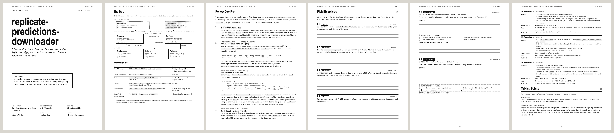

# The Grand Tour

A Claude skill that walks you through a codebase you built, usually with an AI, until you can **explain how it works**: to a user, a collaborator, an interviewer, or an engineer pairing with you.



## Why

Building with an AI often leaves you with a system you understand from the inside and still can't talk about. You know what it does, you had the ideas, you can extend it. Then someone asks "so how does it work?" and the answer comes out vague, or it comes out as *why* you built it rather than *what it does*.

The Grand Tour closes that gap. It reads the whole repo, picks one metaphor that fits its shape, traces one real run through the actual code with toy data, gives you the proper names for patterns you built by instinct, and then makes you say it back, in your own words, until it holds up.

It works just as well for onboarding someone to a team's codebase: it reads the git history, notices the visitor didn't write it, and addresses them as the new owner instead of the builder. Nobody has to say which they are.

It's written to you, as the person who built (or now owns) the thing. It isn't a code review. Problems get their own section near the end, phrased as things you'll want to change, and every real one is there: security findings and confirmed bugs are never cut to save space.

## Three modes

| Mode | What you get |
|---|---|
| **live** (default) | A long guided-tour page, then a six-round scavenger hunt in chat. Most rounds are *Explain how*: a listener, a budget, and you answer in your own words. You get graded on accurate / fitted / confident, then asked to try again. |
| **`print`** | A 14–18 page field guide and workbook to take somewhere with a pen. The guide, eight exercises with two-draft writing space and a printed self-check, and an answer key behind a fold-under stop page that gives the *ingredients* of a good answer, never a paragraph to memorize. |
| **`grade`** | Photograph your filled workbook pages and bring them back. It reads your handwriting, grades your second drafts, checks the stamps you gave yourself, and builds a talking-points card from **your** sentences wherever they passed. |

Live and print share one design, a grayscale field guide with a serif you can read for an hour, so a tour on screen and a booklet on paper are recognisably the same thing. For [replicate-predictions-downloader](https://github.com/closestfriend/replicate-predictions-downloader) there's a complete [live tour page](examples/replicate-predictions-downloader-tour.html) and a complete [print booklet](examples/replicate-predictions-downloader.pdf).

## Install

The skill is this whole folder: `SKILL.md` plus `assets/` (the field-guide style and its fonts) and `examples/` (the reference pages both modes copy their markup from). If only `SKILL.md` gets installed somewhere, the skill fetches the rest from this repo.

- **Claude Code:** clone or copy this folder to `~/.claude/skills/grand-tour/`.
- **Claude apps:** zip this folder and upload it as a custom skill in Claude's settings.

## Use

```
Give me a grand tour of this repo.
grand-tour print
grand-tour grade        (with photos of your filled pages attached)
```

Live mode needs nothing extra: the page is one HTML file with the fonts embedded. Print mode renders the booklet with headless Chromium (Playwright works), and uses `pdftotext` and `pdftoppm` (from Poppler) to fill in page references and check the layout.

## How it fits with explain-diff

The Grand Tour explains a whole project. Geoffrey Litt's [explain-diff](https://gist.github.com/geoffreylitt/a29df1b5f9865506e8952488eac3d524) explains a single change, and it's what this skill was built to sit beside: tour the codebase once, then explain each diff as it lands. The tour's last section, *Where you'd go next*, is the handoff.

The two quiz differently on purpose. explain-diff checks that you understood a change, with multiple choice. The Grand Tour checks that you can *say* it, so every answer is free writing, drafted twice.

## What's in here

```
SKILL.md                      the skill
assets/field-guide/           the style both modes use: brand book, stylesheet, fonts
  README.md                   voice, layout, components, screen and print mechanics
  components/fonts.css        @font-face for the three bundled families (booklets)
  components/fonts-inline.css the same fonts, subset and embedded (single-file tour pages)
  components/bundle.css       the stylesheet, with print and screen layers
  fonts/                      Charter, TeX Gyre Heros Cn, DejaVu Sans Mono (+ LICENSES.md)
examples/                     a finished live tour page, a finished booklet (PDF and HTML), the preview image
```

## License

MIT for everything except the fonts, which keep their own licenses: see [`assets/field-guide/fonts/LICENSES.md`](assets/field-guide/fonts/LICENSES.md).
